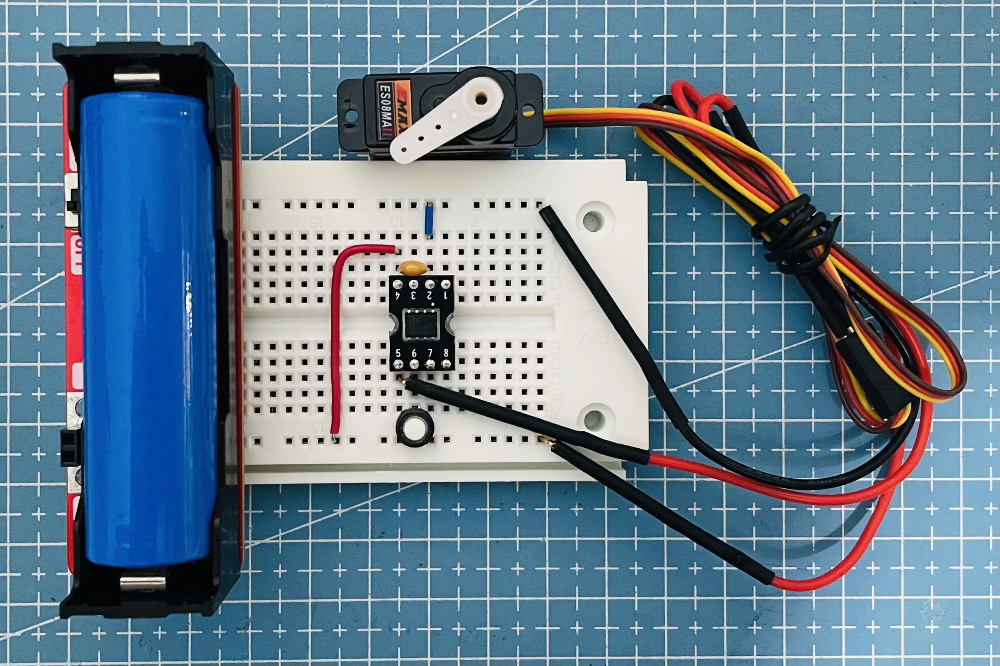

# CH32V003 Servo

Servo driver by CH32V003, use systick to create a fixed period PWM signal and stable pulse width, the logic in the main loop changes the pulse width.

## Reference

- [ch32v003fun/examples/systick_irq](https://github.com/cnlohr/ch32v003fun/blob/master/examples/systick_irq/systick_irq.c)
